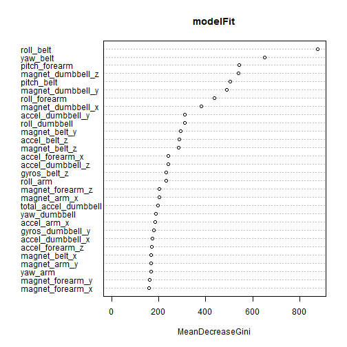

# Practical Machine Learning - Weight Lifting Activity Recogition

## Introduction  

This paper will analyze data from the weight lifting exercises data collected by researchers into human activity recognition. (See Appendix) The objective was to be able to detect when a subject was doing a particular exercise in a correct fashion, or in one of several ways that were incorrect.

## Summary

After downloading and cleaning a data set from the authors I was able to accurately predict all of the exam questions using a Random Forest model. Two models were compared, C5.0 and Random Forest.


## Data

The data was downloaded from the authors website and loaded into R. By reviewing the authors' paper I was able to determine that the rows with new_window set to yes appeared to be summary statistics. I will exclude those rows. I also was able to determine using the code below that 100 variables were all missing. These columns will be removed as well. I then drop some columns at the beginning of the data set related to row id's and date stamps. The classe variable will be the one we want to predict for this exercise. Once complete I have a data set I plan to partition for testing.


```r
setwd("C:\\Users\\Lou\\Documents\\rml\\project")


library(caret)
```

```
## Warning: package 'caret' was built under R version 3.1.2
```

```
## Loading required package: lattice
## Loading required package: ggplot2
```

```
## Warning: package 'ggplot2' was built under R version 3.1.1
```

```r
library(rattle)
```

```
## Warning: package 'rattle' was built under R version 3.1.2
```

```
## Rattle: A free graphical interface for data mining with R.
## Version 3.4.1 Copyright (c) 2006-2014 Togaware Pty Ltd.
## Type 'rattle()' to shake, rattle, and roll your data.
```

```r
library(C50)
```

```
## Warning: package 'C50' was built under R version 3.1.2
```

```r
library(randomForest)
```

```
## Warning: package 'randomForest' was built under R version 3.1.2
```

```
## randomForest 4.6-10
## Type rfNews() to see new features/changes/bug fixes.
```

```r
rawdata <- read.csv("pml-training.csv",  na.strings=c("","NA"))

exam <- read.csv("pml-testing.csv", na.strings=c("","NA"))

#utils::View(rawdata)

#REading documenation shows that the new_window = yes varaibles appear to be summary statistics
#I'll remove them for the analysis

rawdata <- rawdata[rawdata$new_window=="no",]


#Let's see how many variables seem to be all NA....quite a few under visual inspections

NA_vars <- sapply(rawdata, function(x)all(is.na(x))) 

summary(NA_vars)
```

```
##    Mode   FALSE    TRUE    NA's 
## logical      60     100       0
```

```r
#Quite a few variables have all NA, visual inspection confirms that they are all NA
# except for new_window Lets remove them from the analysis.... 


rawdata <- rawdata[colSums(is.na(rawdata)) / nrow(rawdata) < .90]


# These variables based on what documentation I can find are not relevant to our question
# We'll drop them to simplify selection

drops <- c("X","raw_timestamp_part_1","raw_timestamp_part_2","cvtd_timestamp","new_window","num_window")
rawdata <- rawdata[,!(names(rawdata) %in% drops)]
```

## The Models

I'll use two models to try and predict the data, C5.0 and Random Forest. Each of the models does well at predicting categorical variables, which the classe variable is. [Model Documentation] http://topepo.github.io/caret/modelList.html  We'll split the rawdata data frame above into a 75% train and 25% test data set. We'll only run the models on the training data set and evaluate their performance once on the test data set. Measures of success will be the accuracy of the model on both test and training data sets. Any model that fails to yield a similar performance on both data sets will be rejected. The best model of the two will be used to predict the exam questions.

### C5.0

The C5.0 algorithm will be the first model run. I will use up to two trials and run our first model on the training data set. We'll also examine how many trials were used.


```r
# Create test and train partition for C5 model

set.seed(1537)

inTrain <- createDataPartition(y=rawdata$classe,
                               p=0.75, list=FALSE)

trainC5 <- rawdata[inTrain,]
testC5 <- rawdata[-inTrain,]

dim(training)
```

```
## Error: object 'training' not found
```

```r
modelC5a <- C5.0(classe ~ .,data=trainC5,trials=2 )

modelC5a$trials
```

```
## Requested    Actual 
##         2         1
```

Even though we allowed up to two trials the model only used 1. Now let's see how well the model did on the training data set


```r
#Confusion matrix for training dataset

confusionMatrix(predict(modelC5a, newdata=trainC5), trainC5$classe)
```

```
## Confusion Matrix and Statistics
## 
##           Reference
## Prediction    A    B    C    D    E
##          A 4085   13    2    3    1
##          B    9 2762   13    7    6
##          C    4   11 2487    8    8
##          D    5    0    9 2339    5
##          E    1    3    3    4 2626
## 
## Overall Statistics
##                                        
##                Accuracy : 0.992        
##                  95% CI : (0.99, 0.993)
##     No Information Rate : 0.285        
##     P-Value [Acc > NIR] : <2e-16       
##                                        
##                   Kappa : 0.99         
##  Mcnemar's Test P-Value : 0.253        
## 
## Statistics by Class:
## 
##                      Class: A Class: B Class: C Class: D Class: E
## Sensitivity             0.995    0.990    0.989    0.991    0.992
## Specificity             0.998    0.997    0.997    0.998    0.999
## Pos Pred Value          0.995    0.987    0.988    0.992    0.996
## Neg Pred Value          0.998    0.998    0.998    0.998    0.998
## Prevalence              0.285    0.193    0.174    0.164    0.184
## Detection Rate          0.283    0.192    0.173    0.162    0.182
## Detection Prevalence    0.285    0.194    0.175    0.164    0.183
## Balanced Accuracy       0.997    0.994    0.993    0.995    0.996
```

The accuracy was very good at over 99%, but let's examine the test data set to determine if we over fit. The accuracy should remain close to the training data set if we haven't.


```r
confusionMatrix(predict(modelC5a,newdata=testC5),testC5$classe)
```

```
## Confusion Matrix and Statistics
## 
##           Reference
## Prediction    A    B    C    D    E
##          A 1337   20    4    3    3
##          B   16  879   16   12   10
##          C    5   23  805   26    4
##          D    6    2    9  739    6
##          E    3    5    4    6  859
## 
## Overall Statistics
##                                         
##                Accuracy : 0.962         
##                  95% CI : (0.956, 0.967)
##     No Information Rate : 0.285         
##     P-Value [Acc > NIR] : <2e-16        
##                                         
##                   Kappa : 0.952         
##  Mcnemar's Test P-Value : 0.0304        
## 
## Statistics by Class:
## 
##                      Class: A Class: B Class: C Class: D Class: E
## Sensitivity             0.978    0.946    0.961    0.940    0.974
## Specificity             0.991    0.986    0.985    0.994    0.995
## Pos Pred Value          0.978    0.942    0.933    0.970    0.979
## Neg Pred Value          0.991    0.987    0.992    0.988    0.994
## Prevalence              0.285    0.193    0.175    0.164    0.184
## Detection Rate          0.278    0.183    0.168    0.154    0.179
## Detection Prevalence    0.285    0.194    0.180    0.159    0.183
## Balanced Accuracy       0.985    0.966    0.973    0.967    0.985
```

The accuracy dropped to 96% in the test data set. Not bad, but perhaps random forest can do better.


### Random Forest

Next we'll run the random forest model. I will set a different seed and create all new training and test data sets.


```r
set.seed(2048)
inTrain <- createDataPartition(y=rawdata$classe,
                               p=0.75, list=FALSE)

trainRF <- rawdata[inTrain,]
testRF <- rawdata[-inTrain,]

modelFit <- randomForest(classe ~ .,data=trainRF)
modelFit
```

```
## 
## Call:
##  randomForest(formula = classe ~ ., data = trainRF) 
##                Type of random forest: classification
##                      Number of trees: 500
## No. of variables tried at each split: 7
## 
##         OOB estimate of  error rate: 0.53%
## Confusion matrix:
##      A    B    C    D    E class.error
## A 4099    3    0    0    2    0.001218
## B   13 2772    4    0    0    0.006095
## C    0   17 2494    3    0    0.007955
## D    0    0   25 2333    3    0.011859
## E    0    0    2    4 2640    0.002268
```

At first glance the error rate looks very good....lets examine the confusion matrix for the training data set.


```r
confusionMatrix(predict(modelFit,newdata=trainRF),trainRF$classe)
```

```
## Confusion Matrix and Statistics
## 
##           Reference
## Prediction    A    B    C    D    E
##          A 4104    0    0    0    0
##          B    0 2789    0    0    0
##          C    0    0 2514    0    0
##          D    0    0    0 2361    0
##          E    0    0    0    0 2646
## 
## Overall Statistics
##                                 
##                Accuracy : 1     
##                  95% CI : (1, 1)
##     No Information Rate : 0.285 
##     P-Value [Acc > NIR] : <2e-16
##                                 
##                   Kappa : 1     
##  Mcnemar's Test P-Value : NA    
## 
## Statistics by Class:
## 
##                      Class: A Class: B Class: C Class: D Class: E
## Sensitivity             1.000    1.000    1.000    1.000    1.000
## Specificity             1.000    1.000    1.000    1.000    1.000
## Pos Pred Value          1.000    1.000    1.000    1.000    1.000
## Neg Pred Value          1.000    1.000    1.000    1.000    1.000
## Prevalence              0.285    0.193    0.174    0.164    0.184
## Detection Rate          0.285    0.193    0.174    0.164    0.184
## Detection Prevalence    0.285    0.193    0.174    0.164    0.184
## Balanced Accuracy       1.000    1.000    1.000    1.000    1.000
```

The confusion matrix looks excellent...lets see if it will hold up when run against the test group.


```r
confusionMatrix(predict(modelFit,newdata=testRF),testRF$classe)
```

```
## Confusion Matrix and Statistics
## 
##           Reference
## Prediction    A    B    C    D    E
##          A 1367    1    0    0    0
##          B    0  926    3    0    0
##          C    0    2  834    9    0
##          D    0    0    1  777    3
##          E    0    0    0    0  879
## 
## Overall Statistics
##                                         
##                Accuracy : 0.996         
##                  95% CI : (0.994, 0.998)
##     No Information Rate : 0.285         
##     P-Value [Acc > NIR] : <2e-16        
##                                         
##                   Kappa : 0.995         
##  Mcnemar's Test P-Value : NA            
## 
## Statistics by Class:
## 
##                      Class: A Class: B Class: C Class: D Class: E
## Sensitivity             1.000    0.997    0.995    0.989    0.997
## Specificity             1.000    0.999    0.997    0.999    1.000
## Pos Pred Value          0.999    0.997    0.987    0.995    1.000
## Neg Pred Value          1.000    0.999    0.999    0.998    0.999
## Prevalence              0.285    0.193    0.175    0.164    0.184
## Detection Rate          0.285    0.193    0.174    0.162    0.183
## Detection Prevalence    0.285    0.193    0.176    0.163    0.183
## Balanced Accuracy       1.000    0.998    0.996    0.994    0.998
```

This seems to hold up under testing! Let's see which variables were the most important to the model.


```r
varImpPlot(modelFit)
```

 

The decrease in Gini measure looks at the impact of each variable as it related to the terminal nodes at the end of the tree. The larger the value the more important the variable is. We can see the rollbelt and yawbelt are two of the most important measures in the model.

Based on the confusion matrix results we will select this model to submit our answers with.

## Summarized results

Now we need to combine our our two tests and create an overall confusion matrix to estimate the performance of our model.


```r
# Here we find out the combined prediction expectation for both models

testpred <- c(factor(predict(modelC5a,newdata=testC5)), factor(predict(modelFit,newdata=testRF)) )
testact <- c(testC5$classe,testRF$classe )

confusionMatrix(testpred,testact)
```

```
## Confusion Matrix and Statistics
## 
##           Reference
## Prediction    1    2    3    4    5
##          1 2704   21    4    3    3
##          2   16 1805   19   12   10
##          3    5   25 1639   35    4
##          4    6    2   10 1516    9
##          5    3    5    4    6 1738
## 
## Overall Statistics
##                                         
##                Accuracy : 0.979         
##                  95% CI : (0.976, 0.982)
##     No Information Rate : 0.285         
##     P-Value [Acc > NIR] : < 2e-16       
##                                         
##                   Kappa : 0.973         
##  Mcnemar's Test P-Value : 0.00387       
## 
## Statistics by Class:
## 
##                      Class: 1 Class: 2 Class: 3 Class: 4 Class: 5
## Sensitivity             0.989    0.971    0.978    0.964    0.985
## Specificity             0.995    0.993    0.991    0.997    0.998
## Pos Pred Value          0.989    0.969    0.960    0.983    0.990
## Neg Pred Value          0.996    0.993    0.995    0.993    0.997
## Prevalence              0.285    0.193    0.175    0.164    0.184
## Detection Rate          0.282    0.188    0.171    0.158    0.181
## Detection Prevalence    0.285    0.194    0.178    0.161    0.183
## Balanced Accuracy       0.992    0.982    0.985    0.981    0.991
```

Even combining the results of the two models we still see an approximately 98% accuracy rate.

## Conclusion

It was interesting to note that even when the the name of the participant was left in the analysis it did not play a significant role in the models. I would have ordinarily excluded the participant's name to prevent the models from learning how a particular person was doing the exercise or "over fit". 

I'd also like to see a test that includes women. The inclusion would make the study more practical in the real world.


## Appendix

Velloso, E.; Bulling, A.; Gellersen, H.; Ugulino, W.; Fuks, H. Qualitative Activity Recognition of Weight Lifting Exercises. Proceedings of 4th International Conference in Cooperation with SIGCHI (Augmented Human '13) . Stuttgart, Germany: ACM SIGCHI, 2013.

[Paper Location] http://groupware.les.inf.puc-rio.br/har#ixzz3SCW0TNyF

